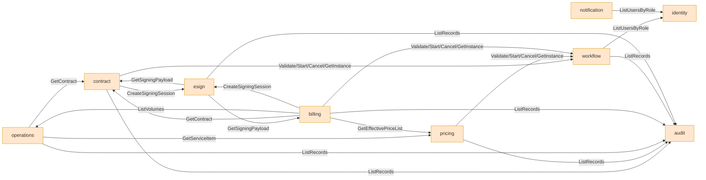

# 01 — High-level architecture

System-level container view of PAS. Names, ports, schemas, events and gRPC methods are the ones fixed in [00-registry.md](00-registry.md) (§1 services, §4 event catalog, §5 sync matrix); decisions cited as D# live in [design-plan.md](../design-plan.md).

**Ground rules shown here:**
- **1 service = 1 database** — one database per service, **no cross-service queries** (D12). One PostgreSQL instance in dev; each service owns its own database (`pas_identity`, `pas_contract`, …) under its own least-privilege login role.
- **Dual transport (D16):** REST/JSON under `/api/v1/…` is the *only* public surface and is reached **only through the edge** (OpenAPI-documented, req §6). gRPC on `:505x` is **service-to-service only**, never routed by the edge, never reachable from outside the network.
- **Broker is Kafka (D2):** topic `pas.events` for all business events, dedicated topic `pas.audit` for the high-volume `audit.recorded` stream.
- **Edge validates — Traefik (D11):** routes REST by resource path prefix (`/api/v1/{resource}` → owning service, strips `/api/v1`), rate-limits, terminates TLS, **and validates the RS256 access-token signature**, then **injects the identity as trusted headers** (`X-User-Id`, `X-Username`, `X-Full-Name`, `X-Department`, `X-Roles`) and strips any client-supplied copies. Services **trust those headers** — they do no JWT/crypto — and only resolve permissions from the Redis-cached role→permission map for authorization. This rests on a **sealed internal network**: services publish no host ports; the edge is the only ingress. `/api/v1/auth/**` is reachable without a token.
- **Two-token auth (D11):** identity signs a short **access token** (RS256 JWT, 15 min) with its private key; the edge validates with the public key. Login also returns a long **refresh token** (opaque, 14 days, rotating with family reuse-detection, stored in `pas_identity`). No JWT blacklist — access tokens are un-revocable by design and simply expire; revocation lives on the refresh side (revoke the family on logout / user-disable). Redis holds **only** the permission cache.

## Container view

```mermaid
flowchart TB
  FE["web-frontend<br/>:3000 · role-based SPA"]:::client
  GW["traefik :80<br/>route · validate JWT · inject headers · rate-limit · TLS"]:::edge
  REDIS[("Redis<br/>perm:role cache")]:::infra
  KAFKA[("Kafka<br/>pas.events · pas.audit")]:::infra
  EXT["esign-mock-provider<br/>:9001 · external"]:::ext

  subgraph SVC["Services — REST :80xx (public via edge) + gRPC :505x (internal only)"]
    direction LR
    ID["identity-service<br/>:8001 / :50051"]:::svc
    CT["contract-service<br/>:8002 / :50052"]:::svc
    PR["pricing-service<br/>:8003 / :50053"]:::svc
    OP["operations-service<br/>:8004 / :50054"]:::svc
    BI["billing-service<br/>:8005 / :50055"]:::svc
    WF["workflow-service<br/>:8006 / :50056"]:::svc
    ES["esign-service<br/>:8007 / :50057"]:::svc
    NO["notification-service<br/>:8008"]:::svc
    AU["audit-service<br/>:8009 / :50059"]:::svc
  end

  IDDB[("identity")]:::db
  CTDB[("contract")]:::db
  PRDB[("pricing")]:::db
  OPDB[("operations")]:::db
  BIDB[("billing")]:::db
  WFDB[("workflow")]:::db
  ESDB[("esign")]:::db
  NODB[("notification")]:::db
  AUDB[("audit")]:::db

  FE -->|HTTPS · /api/v1| GW
  GW -->|REST :80xx + identity headers| ID & CT & PR & OP & BI & WF & ES & NO & AU

  ID --- IDDB
  CT --- CTDB
  PR --- PRDB
  OP --- OPDB
  BI --- BIDB
  WF --- WFDB
  ES --- ESDB
  NO --- NODB
  AU --- AUDB

  ID -.->|write perm:role:*| REDIS
  SVC -.->|read perm:role:*| REDIS

  WF -.->|workflow.*| KAFKA
  ES -.->|esign.session_completed| KAFKA
  CT -.->|document.expiring| KAFKA
  PR -.->|document.expiring| KAFKA
  OP -.->|operations.period_locked| KAFKA
  ID & CT & PR & OP & BI & WF & ES -.->|audit.recorded → pas.audit| KAFKA
  KAFKA -.->|audit.recorded| AU
  KAFKA -.->|all notifications| NO
  KAFKA -.->|workflow.completed / esign flips| CT & PR & BI

  ES -->|send document| EXT
  EXT -->|POST /callbacks/esign webhook| ES

  classDef client fill:#dae8fc,stroke:#6c8ebf;
  classDef edge fill:#d5e8d4,stroke:#82b366;
  classDef svc fill:#ffe6cc,stroke:#d79b00;
  classDef db fill:#f5f5f5,stroke:#666666;
  classDef infra fill:#e1d5e7,stroke:#9673a6;
  classDef ext fill:#fff2cc,stroke:#d6b656;
```

**Reading the edges**

| Line | Meaning |
|---|---|
| solid `→` | synchronous REST (user traffic, always via the edge, which validates the JWT and injects identity headers) or the esign webhook |
| plain link `—` | service ↔ its own database (1:1, D12) |
| dashed `-.→` | asynchronous Kafka publish / consume (labelled with event types, §4) |
| dashed to Redis | permission-cache traffic (§6) — identity writes `perm:role:*`, every service reads it to authorize a request |

`audit.recorded` is produced by all seven state-owning services and is the only stream on `pas.audit`; audit-service is a pure read-model sink (D15). `notification-service` and `audit-service` consume only — they have no internal callers and expose no gRPC.

## Internal gRPC dependencies (sync, §5)

Separate view so the container diagram stays legible — these are the `:505x` service-to-service calls, never crossing the edge. Full signatures in [registry §5](00-registry.md#5-sync-api-dependency-matrix).

Note the shape: **contract, pricing, operations, identity are leaf providers**; **billing is the busiest caller** (it composes a statement from contract + pricing + operations); **workflow, esign and audit are called by the document owners** (contract, pricing, billing). identity is called only for role→user resolution (workflow, notification) — never on the request hot path for permissions, which is the Redis cache instead (D11).

## Components

| Component | Port(s) | DB | Role |
|---|---|---|---|
| web-frontend | 3000 | — | single SPA, role-based menus |
| traefik (edge) | 80 / 443 | — (stateless) | route `/api/v1/{resource}` → service, validate RS256 JWT, inject identity headers, rate-limit, TLS |
| identity-service | 8001 / 50051 | `identity` | users, roles, permissions; RS256 JWT issue; rotating refresh tokens |
| contract-service | 8002 / 50052 | `contract` | customers, contracts, addenda, attachments |
| pricing-service | 8003 / 50053 | `pricing` | service catalog, price lists, versions |
| operations-service | 8004 / 50054 | `operations` | operation periods, volume records |
| billing-service | 8005 / 50055 | `billing` | payment statements, lines, line↔volume links |
| workflow-service | 8006 / 50056 | `workflow` | document-type config, workflow definitions/instances/steps |
| esign-service | 8007 / 50057 | `esign` | signing sessions, callback log |
| notification-service | 8008 | `notification` | notifications (consume-only) |
| audit-service | 8009 / 50059 | `audit` | the audit trail (4.10) — sole store, read model |
| esign-mock-provider | 9001 | — | external mock signer; delayed webhook callback |
| Kafka | — | — | broker: `pas.events`, `pas.audit` (D2) |
| Redis | — | — | `perm:role:*` permission cache (D11) |
| PostgreSQL | — | 9 databases | one instance, database per service (own login role), no cross-service queries (D12) |
