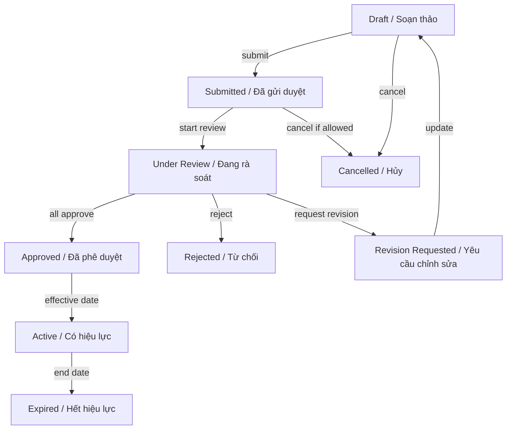
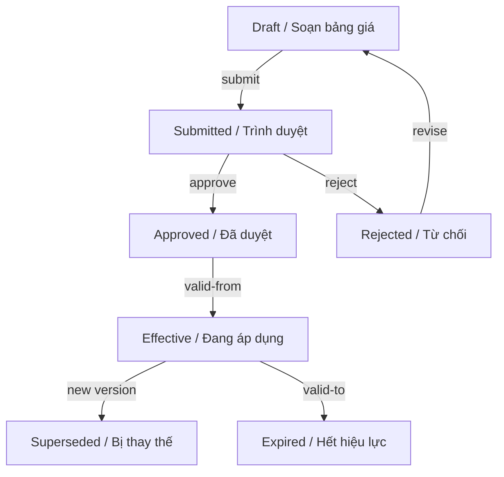
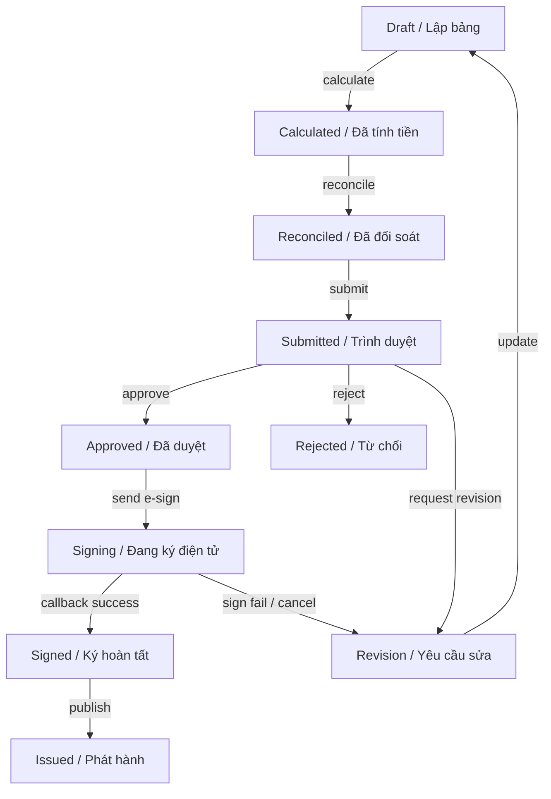
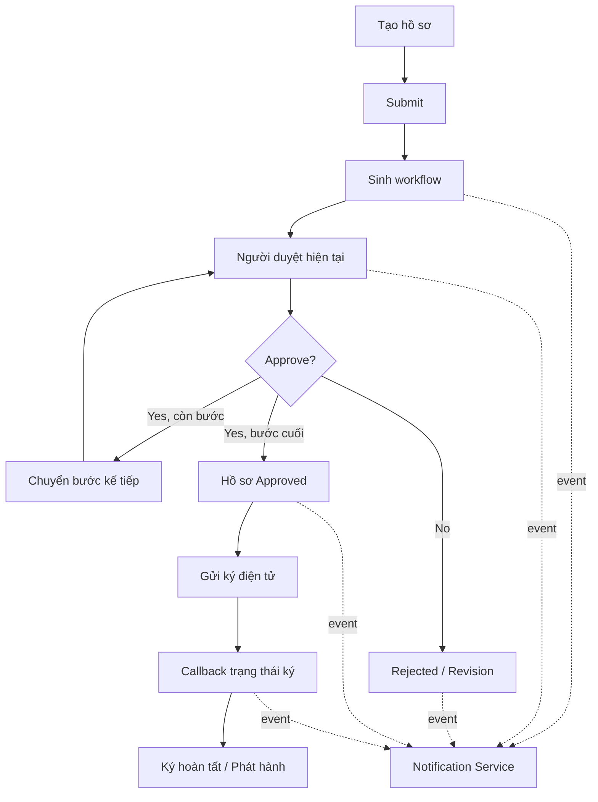

**TRƯỜNG ĐẠI HỌC KHOA HỌC TỰ NHIÊN**  
**KHOA CÔNG NGHỆ THÔNG TIN**  

#### **ĐỒ ÁN THỰC HÀNH**  
#### **MÔN ỨNG DỤNG PHÂN TÁN**  

**Đề tài: Quản trị kinh doanh**

**1. Bối cảnh doanh nghiệp**  
Công ty ABC là doanh nghiệp cung cấp dịch vụ logistics, khai thác cảng và các dịch vụ liên quan đến vận chuyển, lưu kho, bốc xếp, vận hành thiết bị. Mỗi tháng công ty phát sinh nhiều hợp đồng dịch vụ, phụ lục hợp đồng, bảng giá, sản lượng thực tế, bảng thanh toán và hồ sơ trình ký giữa nhiều phòng ban.  
Hiện trạng xử lý thủ công qua email, Excel và giấy tờ khiến thông tin phân tán, khó kiểm soát trạng thái, khó xác định ai đang giữ hồ sơ, khó truy vết lịch sử thay đổi và dễ xảy ra sai lệch khi bảng giá, sản lượng hoặc thanh toán thay đổi.  
Ban lãnh đạo yêu cầu xây dựng một hệ thống tập trung để quản lý vòng đời hồ sơ kinh doanh, từ khách hàng, hợp đồng, bảng giá, sản lượng, bảng thanh toán đến phê duyệt và ký điện tử.  

**2. Các phòng ban tham gia**  

| Phòng ban | Vai trò nghiệp vụ chính |
| :--- | :--- |
| Kinh doanh | Quản lý khách hàng, tạo hợp đồng, đề xuất bảng giá, theo dõi tình trạng ký kết. |
| Khai thác | Ghi nhận sản lượng thực tế, kiểm tra dữ liệu vận hành, đối soát sản lượng. |
| Kế toán | Kiểm tra hồ sơ thanh toán, lập/kiểm tra bảng thanh toán, theo dõi công nợ. |
| Pháp chế | Rà soát điều khoản hợp đồng, kiểm tra phụ lục, góp ý trước khi trình ký. |
| Ban Giám đốc | Phê duyệt hợp đồng, bảng giá, bảng thanh toán và các hồ sơ quan trọng. |
| Quản trị hệ thống | Quản lý người dùng, phân quyền, cấu hình workflow, cấu hình loại hồ sơ. |

**3. Quy trình nghiệp vụ tổng quát**  
1. Phòng Kinh doanh tạo thông tin khách hàng và hồ sơ hợp đồng.  
2. Hợp đồng được gửi qua luồng rà soát/phê duyệt của Kinh doanh, Pháp chế và Ban Giám đốc.  
3. Sau khi hợp đồng được duyệt, Phòng Kinh doanh hoặc bộ phận phụ trách tạo bảng giá tương ứng.  
4. Bảng giá được phê duyệt và có hiệu lực theo thời gian.  
5. Phòng Khai thác ghi nhận sản lượng thực tế theo kỳ.  
6. Kế toán lập bảng thanh toán dựa trên hợp đồng, bảng giá và sản lượng.  
7. Bảng thanh toán được đối soát, trình phê duyệt và gửi ký điện tử.  
8. Sau khi ký hoàn tất, hồ sơ được phát hành và lưu trữ.  

**4. Chức năng nghiệp vụ mong muốn**  

**4.1 Quản lý khách hàng**  
* Tạo mới, cập nhật và tạm ngưng khách hàng.  
* Lưu mã khách hàng, tên, mã số thuế, địa chỉ, người đại diện, thông tin liên hệ, trạng thái.  
* Cho phép tra cứu các hợp đồng, bảng giá, bảng thanh toán đã phát sinh theo khách hàng.  

**4.2 Quản lý hợp đồng**  
* Tạo hợp đồng với thông tin khách hàng, thời gian hiệu lực, giá trị, điều khoản thanh toán, điều khoản dịch vụ và tệp đính kèm.  
* Chỉnh sửa hợp đồng khi còn ở trạng thái được phép.  
* Gửi hợp đồng trình duyệt, theo dõi người đang xử lý và lịch sử xử lý.  
* Gia hạn hợp đồng, hủy hợp đồng, hoặc tạo phụ lục hợp đồng khi cần thay đổi.  

**4.3 Quản lý phụ lục hợp đồng**  
* Tạo phụ lục gắn với hợp đồng đã tồn tại.  
* Phụ lục có thể thay đổi đơn giá, thời hạn hiệu lực, điều khoản thanh toán hoặc bổ sung dịch vụ.  
* Phụ lục phải trải qua luồng phê duyệt tương tự hoặc khác hợp đồng chính tùy cấu hình.  
* Sau khi phụ lục có hiệu lực, các nghiệp vụ phát sinh sau thời điểm hiệu lực phải sử dụng thông tin mới.  

**4.4 Quản lý bảng giá**  
* Tạo bảng giá theo khách hàng, hợp đồng, nhóm dịch vụ hoặc loại dịch vụ.  
* Khai báo thời gian hiệu lực từ ngày đến ngày.  
* Quản lý nhiều phiên bản bảng giá và lịch sử thay đổi.  
* Không cho phép hai bảng giá cùng loại bị chồng thời gian hiệu lực nếu áp dụng cho cùng đối tượng.  

**4.5 Quản lý sản lượng thực hiện**  
* Phòng Khai thác ghi nhận sản lượng thực tế như số container, số tấn hàng, số chuyến vận chuyển, số ngày lưu kho.  
* Cho phép điều chỉnh dữ liệu trước khi khóa kỳ.  
* Sau khi khóa kỳ, dữ liệu không được chỉnh sửa nếu không có quyền đặc biệt.  
* Dữ liệu sản lượng là đầu vào để lập bảng thanh toán.  

**4.6 Quản lý bảng thanh toán**  
* Lập bảng thanh toán dựa trên hợp đồng, bảng giá đang có hiệu lực và sản lượng thực tế.  
* Bảng thanh toán gồm danh sách dịch vụ, đơn giá, sản lượng tính phí, thành tiền, thuế và tổng tiền.  
* Cho phép đối chiếu/chỉnh sửa có kiểm soát trước khi trình duyệt.  
* Sau khi bảng thanh toán được duyệt và ký, không được sửa trực tiếp mà phải tạo hồ sơ điều chỉnh.  

**4.7 Quản lý quy trình phê duyệt**  
* Mỗi loại hồ sơ có thể có quy trình phê duyệt khác nhau.  
* Người dùng có thể gửi hồ sơ, phê duyệt, từ chối, yêu cầu chỉnh sửa và theo dõi tiến độ.  
* Hệ thống phải hiển thị người đang xử lý, các bước đã hoàn thành và các bước còn lại.  
* Quy trình phê duyệt không được hard-code theo if/else đơn giản.  

**4.8 Áp dụng chữ ký điện tử**  
* Sau khi hồ sơ được phê duyệt nội bộ, hệ thống có thể gửi hồ sơ sang dịch vụ ký điện tử.  
* Sinh viên tự nghiên cứu và đề xuất mô hình chữ ký điện tử mô phỏng hoặc tích hợp dịch vụ bên thứ ba.  
* Hệ thống cần quản lý trạng thái: chờ gửi ký, đang ký, ký thành công, ký thất bại, hủy ký.  
* Không yêu cầu chữ ký số hợp lệ pháp lý; trọng tâm là thiết kế tích hợp, trạng thái và bất đồng bộ.  

**4.9 Quản lý thông báo**  
* Thông báo khi có hồ sơ cần xử lý, hồ sơ bị từ chối, hồ sơ được duyệt, ký điện tử hoàn tất, hợp đồng hoặc bảng giá sắp hết hạn.  
* Notification Service nên nhận event bất đồng bộ từ các service khác.  
* Người dùng xem danh sách thông báo của mình và đánh dấu đã đọc.  

**4.10 Nhật ký và truy vết**  
* Ghi lại ai thực hiện, thời điểm, hành động, trạng thái trước/sau và ghi chú.  
* Lịch sử phải tra cứu được theo từng hợp đồng, bảng giá, bảng thanh toán và phiên ký.  
* Audit log không được phụ thuộc vào dữ liệu hiển thị hiện tại; cần giữ được vết thay đổi quan trọng.  

**Sơ đồ trạng thái Hợp đồng/Hồ sơ:**

**Sơ đồ trạng thái Bảng giá:**

**5. Business rules và sơ đồ trạng thái Lưu ý cho sinh viên**  
Các trạng thái dưới đây là định hướng tối thiểu để sinh viên hiểu nghiệp vụ. Nhóm được phép điều chỉnh hoặc mở rộng, nhưng phải giải thích rõ trong tài liệu thiết kế và demo.  

**5.1 Trạng thái hợp đồng**  

| Mã rule | Business rule cho hợp đồng |
| :--- | :--- |
| CTR-01 | Chỉ được chỉnh sửa hợp đồng ở trạng thái Draft hoặc Revision Requested. |
| CTR-02 | Hợp đồng chỉ được Submit khi có khách hàng hợp lệ, thời gian hiệu lực hợp lệ và có ít nhất một tệp/hạng mục nội dung bắt buộc. |
| CTR-03 | Không được chuyển trực tiếp từ Draft sang Approved. Hợp đồng phải đi qua quy trình phê duyệt. |
| CTR-04 | Hợp đồng bị Rejected không được tự động sửa và submit lại; cần tạo bản chỉnh sửa hoặc chuyển về Revision theo quy tắc nhóm thiết kế. |
| CTR-05 | Hợp đồng Approved chỉ chuyển Active khi đến ngày hiệu lực. |
| CTR-06 | Hợp đồng Active không được xóa; nếu không sử dụng nữa phải chuyển Cancelled hoặc Expired theo quy tắc nghiệp vụ. |
| CTR-07 | Khi hợp đồng Active/Approved bị thay đổi điều khoản quan trọng, phải tạo phụ lục thay vì sửa trực tiếp. |

**5.2 Trạng thái bảng giá**  

| Mã rule | Business rule cho bảng giá |
| :--- | :--- |
| PRC-01 | Bảng giá phải gắn với khách hàng, hợp đồng, nhóm dịch vụ hoặc phạm vi áp dụng rõ ràng. |
| PRC-02 | Bảng giá phải có thời gian hiệu lực; ngày bắt đầu không được lớn hơn ngày kết thúc. |
| PRC-03 | Không cho phép hai bảng giá Effective bị chồng thời gian hiệu lực cho cùng đối tượng áp dụng và cùng loại dịch vụ. |
| PRC-04 | Khi tạo version mới, version cũ phải được đánh dấu Superseded hoặc hết hiệu lực theo ngày. |
| PRC-05 | Bảng giá đã dùng để sinh bảng thanh toán không được sửa trực tiếp; phải tạo version mới. |
| PRC-06 | Bảng giá Rejected có thể chỉnh sửa lại và submit lại nếu nhóm thiết kế cho phép. |

**Sơ đồ trạng thái Bảng thanh toán:**

**Sơ đồ Luồng phê duyệt và thông báo:**

**5.3 Trạng thái bảng thanh toán**  

| Mã rule | Business rule cho bảng thanh toán |
| :--- | :--- |
| PAY-01 | Bảng thanh toán chỉ được lập khi hợp đồng còn hiệu lực và có bảng giá phù hợp tại kỳ tính phí. |
| PAY-02 | Sản lượng dùng để tính phí phải thuộc kỳ thanh toán và đã được xác nhận/đối soát theo quy tắc nhóm thiết kế. |
| PAY-03 | Bảng thanh toán phải lưu đơn giá tại thời điểm tính phí để không bị thay đổi khi bảng giá version mới xuất hiện. |
| PAY-04 | Không cho phép submit bảng thanh toán nếu tổng tiền âm hoặc thiếu dòng dịch vụ bắt buộc. |
| PAY-05 | Sau khi Approved hoặc Signed, không được sửa trực tiếp; nếu sai phải tạo hồ sơ điều chỉnh hoặc hủy theo quy trình. |
| PAY-06 | Một bảng thanh toán chỉ được gửi ký điện tử sau khi đã Approved nội bộ. |
| PAY-07 | Nếu ký điện tử thất bại hoặc bị hủy, trạng thái phải phản ánh rõ để người dùng biết cần xử lý lại. |

**5.4 Luồng phê duyệt và ký điện tử**  

| Mã rule | Business rule cho phê duyệt và ký điện tử |
| :--- | :--- |
| APR-01 | Chỉ người được giao ở bước hiện tại mới được approve/reject/request revision. Kiểm tra role là chưa đủ. |
| APR-02 | Không cho phép duyệt nhảy bước hoặc duyệt lại bước đã hoàn thành. |
| APR-03 | Mỗi hành động phê duyệt phải ghi comment hoặc lý do nếu reject/request revision. |
| APR-04 | Nếu một bước bị Reject, hồ sơ kết thúc ở trạng thái Rejected hoặc quay về Revision theo quy tắc được thiết kế. |
| APR-05 | Khi bước cuối cùng được approve, hồ sơ chuyển Approved và có thể phát sinh event để gửi ký điện tử. |
| APR-06 | Dịch vụ ký điện tử có thể xử lý bất đồng bộ và trả callback/webhook; hệ thống phải cập nhật trạng thái ký tương ứng. |
| APR-07 | Nếu Notification Service hoặc E-Sign Service tạm thời lỗi, nghiệp vụ chính không nên làm hỏng dữ liệu đã duyệt; cần có cơ chế retry hoặc trạng thái chờ xử lý. |

**5.5 Các ràng buộc kỹ thuật gắn với business rule**  

| Vấn đề | Yêu cầu xử lý |
| :--- | :--- |
| Double submit | Một người dùng bấm Submit nhiều lần không được tạo nhiều workflow instance. Khuyến khích dùng Idempotency-Key hoặc unique constraint. |
| Race condition khi duyệt | Hai request approve cùng lúc không được làm một bước duyệt hoàn thành hai lần. Khuyến khích transaction, row-level locking hoặc optimistic locking. |
| Event bị mất | Khi cập nhật trạng thái và gửi event, cần cân nhắc Outbox Pattern hoặc cơ chế retry để tránh mất thông báo/sự kiện. |
| Phân quyền theo ngữ cảnh | Manager A không được duyệt hồ sơ của Manager B nếu không phải assignee của bước hiện tại. |
| Dữ liệu lịch sử | Bảng thanh toán phải lưu đơn giá tại thời điểm tính, không phụ thuộc vào bảng giá hiện tại. |
| Tích hợp ký điện tử | Cần mô hình trạng thái riêng cho phiên ký; không trộn lẫn trạng thái phê duyệt và trạng thái ký nếu gây mơ hồ. |

**6. Yêu cầu kỹ thuật cụ thể**  
* Kiến trúc Microservices, tối thiểu 4 service nghiệp vụ ngoài API Gateway.  
* Có API Gateway để điều phối request và xác thực cơ bản.  
* Backend sử dụng FastAPI/Java, có OpenAPI/Swagger.  
* Mỗi service quan trọng có database riêng hoặc schema riêng; sinh viên phải giải thích lựa chọn.  
* Sử dụng PostgreSQL cho dữ liệu nghiệp vụ.  
* Sử dụng Redis cho cache, rate limiting hoặc session/token blacklist tùy thiết kế.  
* Sử dụng Kafka hoặc RabbitMQ cho ít nhất một luồng bất đồng bộ.  
* Có Docker Compose để chạy môi trường dev.  
* Có Kubernetes manifests để triển khai trên minikube hoặc môi trường tương đương.  
* Có logging, error handling, validation input và phân quyền tối thiểu bằng JWT.
